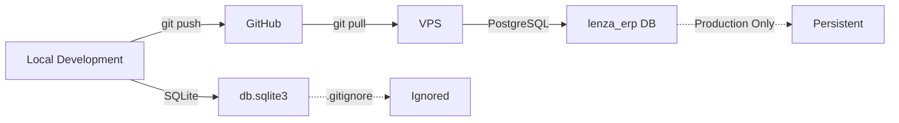

# ENV yordamida Database Configuratsiyasi

Bu loyihada **ikkita muhit** mavjud:
- **Local (development)**: SQLite3
- **Production (VPS)**: PostgreSQL

## 1. Konfiguratsiya Mexanizmi

### settings.py
```python
ENV = os.getenv('ENV', 'development').lower()
USE_POSTGRES = ENV == 'production' or os.getenv('USE_POSTGRES', 'false').lower() == 'true'

if USE_POSTGRES:
    # PostgreSQL
    DATABASES = {
        'default': {
            'ENGINE': 'django.db.backends.postgresql',
            'NAME': os.getenv('POSTGRES_DB', 'lenza_erp'),
            'USER': os.getenv('POSTGRES_USER', 'admin'),
            'PASSWORD': os.getenv('POSTGRES_PASSWORD', 'maxdoors123'),
            'HOST': os.getenv('POSTGRES_HOST', 'localhost'),
            'PORT': os.getenv('POSTGRES_PORT', '5432'),
        }
    }
else:
    # SQLite3 (local development)
    DATABASES = {
        'default': {
            'ENGINE': 'django.db.backends.sqlite3',
            'NAME': BASE_DIR / 'db.sqlite3',
        }
    }
```

## 2. Local Development (SQLite)

### Backend uchun .env yarating:
```bash
# backend/.env
ENV=development
DJANGO_DEBUG=True
DJANGO_SECRET_KEY=dev-secret-key-change-me
DJANGO_ALLOWED_HOSTS=127.0.0.1,localhost
USE_POSTGRES=False
```

### Migration va ishga tushirish:
```bash
cd backend
python manage.py migrate
python manage.py createsuperuser
python manage.py runserver
```

**Natija**: `db.sqlite3` fayli `backend/` papkasida yaratiladi (`.gitignore`da ignore qilingan).

## 3. Production (VPS - PostgreSQL)

### VPS setup script avtomatik sozlaydi:
```bash
# scripts/setup_vps.sh ichida
ENV=production
USE_POSTGRES=True
POSTGRES_DB=lenza_erp
POSTGRES_USER=lenza_user
POSTGRES_PASSWORD=ChangeMeNow123!
```

### VPS'da o'rnatish:
```bash
# VPS'da root sifatida
chmod +x scripts/setup_vps.sh
./scripts/setup_vps.sh
```

Script quyidagilarni bajaradi:
1. PostgreSQL server o'rnatadi
2. Database va user yaratadi
3. `.env` faylini `ENV=production` bilan yaratadi
4. `python manage.py migrate` ishga tushiradi
5. Gunicorn + Daphne servislarini sozlaydi

## 4. .gitignore

Quyidagilar repositoryga kiritmaydi:
```gitignore
# Databases
db.sqlite3
*.sqlite3
*.db
*.sqlite

# Environment
.env
.env.production
.env.local

# Python cache
__pycache__/
*.pyc

# Media
media/
```

## 5. Database o'zgartirish (Local ↔ Production)

### Local'da test qilish uchun PostgreSQL ishlatish:
```bash
# backend/.env
ENV=development
USE_POSTGRES=True
POSTGRES_DB=lenza_erp_dev
POSTGRES_USER=postgres
POSTGRES_PASSWORD=postgres
POSTGRES_HOST=localhost
POSTGRES_PORT=5432
```

### Production'da SQLite ishlatish (tavsiya etilmaydi):
```bash
# VPS'da .env
ENV=development
USE_POSTGRES=False
```

## 6. Xatoliklarni bartaraf qilish

### "no such table" xatosi
```bash
# Migration'lar ishga tushmagan
python manage.py migrate
```

### "password authentication failed"
```bash
# PostgreSQL user/password xato
# .env faylda tekshiring:
POSTGRES_USER=lenza_user
POSTGRES_PASSWORD=ChangeMeNow123!
```

### VPS'da ENV noto'g'ri
```bash
# Tekshirish
cat /opt/lenza_erp/.env | grep ENV

# Agar yo'q bo'lsa qo'shish
echo "ENV=production" >> /opt/lenza_erp/.env
systemctl restart lenza_erp.service
```

## 7. Migration'lar

### Local'da yaratish:
```bash
cd backend
python manage.py makemigrations
python manage.py migrate
git add */migrations/*.py
git commit -m "Add migration for X feature"
git push
```

### VPS'da qo'llash:
```bash
cd /opt/lenza_erp/src
git pull origin main
source /opt/lenza_erp/venv/bin/activate
cd backend
python manage.py migrate
systemctl restart lenza_erp.service
```

## 8. Xavfsizlik

### ❌ QILMANG:
- `db.sqlite3` ni git'ga commit qilmang
- `.env` faylini repositoryga yuklmang
- Production parollarini .env.example'da qoldirmang

### ✅ QILING:
- `.gitignore` da barcha database fayllarini ignore qiling
- Har bir muhit uchun o'z `.env` faylini yarating
- Production'da kuchli parollar ishlating
- `ENV=production` ni VPS'da o'rnating

## 9. Deployment Workflow



**Local**:
1. Code yozing (`ENV=development`, SQLite)
2. Test qiling
3. `git add`, `git commit`, `git push`

**VPS**:
1. `cd /opt/lenza_erp/src`
2. `git pull origin main`
3. `bash scripts/update_from_git.sh` (avtomatik migration + restart)

## 10. Tez Yordam

| Savol | Javob |
|-------|-------|
| Local'da qaysi DB? | SQLite3 (`db.sqlite3`) |
| VPS'da qaysi DB? | PostgreSQL (`lenza_erp`) |
| Qaysi variable switch qiladi? | `ENV=development` / `ENV=production` |
| db.sqlite3 git'ga kiradimi? | Yo'q (`.gitignore`) |
| Migration'lar qanday? | Local'da yarating, VPS'da apply qiling |
| Test uchun postgres local'da? | `USE_POSTGRES=True` + postgres install |

---

**Xulosa**: `ENV=development` → SQLite, `ENV=production` → PostgreSQL. Repositoryda hech qachon `db.sqlite3` bo'lmaydi!
