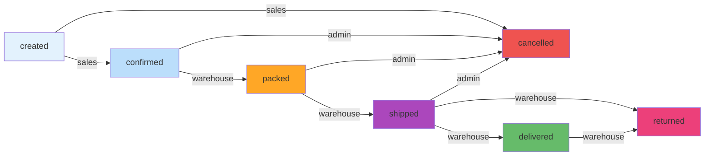

# Warehouse Order Status Flow - Visual Guide

## 🎯 Problem: Warehouse Cannot Complete Order Lifecycle

### ❌ Before Fix

```
Warehouse User Perspective:

confirmed ──✅──> packed ──✅──> shipped ──❌──> delivered
                                           └──❌──> returned

Error Message:
"ValidationError: shipped -> delivered is not permitted"
"ValidationError: delivered -> returned is not permitted"
```

### ✅ After Fix

```
Warehouse User Perspective:

confirmed ──✅──> packed ──✅──> shipped ──✅──> delivered ──✅──> returned
                                        └──✅──> returned
```

---

## 📋 Complete Status Flow Diagram

### All Roles Combined



### Warehouse-Only Flow (Strict Sequential)

```
┌───────────┐
│ confirmed │ ← Sales creates and confirms
└─────┬─────┘
      │ ✅ warehouse can pack
      ▼
  ┌──────┐
  │packed│
  └───┬──┘
      │ ✅ warehouse can ship
      ▼
 ┌────────┐
 │shipped │
 └───┬────┘
     │ ✅ warehouse can mark as delivered
     │ ✅ warehouse can mark as returned (direct return)
     ▼
┌───────────┐
│ delivered │
└─────┬─────┘
      │ ✅ warehouse can mark as returned (post-delivery return)
      ▼
 ┌──────────┐
 │ returned │ ← Terminal state
 └──────────┘
```

---

## 🔧 Technical Implementation

### Backend: STATUS_FLOW Dictionary

**File:** `backend/orders/views.py`

```python
# ❌ OLD - Incomplete
STATUS_FLOW = {
    Order.Status.CREATED: {Order.Status.CONFIRMED, Order.Status.CANCELLED},
    Order.Status.CONFIRMED: {Order.Status.PACKED, Order.Status.CANCELLED},
    Order.Status.PACKED: {Order.Status.SHIPPED, Order.Status.CANCELLED},
    Order.Status.SHIPPED: {Order.Status.DELIVERED, Order.Status.CANCELLED},
    # Missing: delivered → returned
}

# ✅ NEW - Complete
STATUS_FLOW = {
    Order.Status.CREATED: {Order.Status.CONFIRMED, Order.Status.CANCELLED},
    Order.Status.CONFIRMED: {Order.Status.PACKED, Order.Status.CANCELLED},
    Order.Status.PACKED: {Order.Status.SHIPPED, Order.Status.CANCELLED},
    Order.Status.SHIPPED: {Order.Status.DELIVERED, Order.Status.RETURNED, Order.Status.CANCELLED},  # ← Added RETURNED
    Order.Status.DELIVERED: {Order.Status.RETURNED},  # ← NEW LINE
}
```

### Backend: WAREHOUSE_FLOW (Already Correct)

**File:** `backend/orders/models.py`

```python
# ✅ This was already correct - just needed STATUS_FLOW to match
WAREHOUSE_FLOW = {
    'confirmed': 'packed',
    'packed': 'shipped',
    'shipped': 'delivered',
    'delivered': 'returned',
}
```

### Backend: Validation Logic

**File:** `backend/orders/views.py` - `_set_status()` method

```python
def _set_status(self, order: Order, new_status: str | None):
    if not new_status:
        raise ValidationError({'status': 'Status is required.'})
    
    if new_status not in dict(Order.Status.choices):
        raise ValidationError({'status': 'Invalid status value.'})
    
    # ✅ This now passes for warehouse role
    allowed = STATUS_FLOW.get(order.status, set())
    if allowed and new_status not in allowed:
        raise ValidationError({'status': f'{order.status} -> {new_status} is not permitted.'})
    
    order._status_actor = self.request.user
    order.status = new_status
    order.save()
```

### Frontend: OrderStatus Component (No Changes Needed)

**File:** `frontend/src/components/OrderStatus.tsx`

```tsx
export const OrderStatus = ({ 
  value,           // Current status
  orderId, 
  allowedStatuses  // ✅ Backend sends this based on user role
}: OrderStatusProps) => {
  
  const handleChange = (newStatus: string) => {
    // ✅ Frontend automatically filters by backend's allowed statuses
    if (!allowedStatuses.includes(newStatus)) {
      message.warning(t('orders.status.notAllowed'));
      return;
    }
    // ... proceed with update
  }
}
```

---

## 🧪 Testing Scenarios

### Test Case 1: Warehouse Full Lifecycle

```bash
# Setup: Create order as sales
curl -X POST /api/orders/ \
  -H "Authorization: Bearer {sales_token}" \
  -d '{"dealer": 1, "items": [...], "status": "created"}'

# Step 1: Sales confirms
curl -X PATCH /api/orders/123/status/ \
  -H "Authorization: Bearer {sales_token}" \
  -d '{"status": "confirmed"}'
# Expected: ✅ Status = confirmed

# Step 2: Warehouse packs
curl -X PATCH /api/orders/123/status/ \
  -H "Authorization: Bearer {warehouse_token}" \
  -d '{"status": "packed"}'
# Expected: ✅ Status = packed

# Step 3: Warehouse ships
curl -X PATCH /api/orders/123/status/ \
  -H "Authorization: Bearer {warehouse_token}" \
  -d '{"status": "shipped"}'
# Expected: ✅ Status = shipped

# Step 4: Warehouse marks delivered
curl -X PATCH /api/orders/123/status/ \
  -H "Authorization: Bearer {warehouse_token}" \
  -d '{"status": "delivered"}'
# Expected: ✅ Status = delivered (FIXED!)

# Step 5: Warehouse marks returned
curl -X PATCH /api/orders/123/status/ \
  -H "Authorization: Bearer {warehouse_token}" \
  -d '{"status": "returned"}'
# Expected: ✅ Status = returned (FIXED!)
```

### Test Case 2: Direct Return from Shipped

```bash
# Order is at shipped status
# Warehouse can skip delivered and go directly to returned

curl -X PATCH /api/orders/123/status/ \
  -H "Authorization: Bearer {warehouse_token}" \
  -d '{"status": "returned"}'
# Expected: ✅ Status = returned (FIXED!)
```

### Test Case 3: Warehouse Cannot Skip Steps

```bash
# Order is at packed status
# Try to jump directly to delivered (skipping shipped)

curl -X PATCH /api/orders/123/status/ \
  -H "Authorization: Bearer {warehouse_token}" \
  -d '{"status": "delivered"}'
# Expected: ❌ PermissionDenied: "Warehouse can only move packed -> shipped"
```

---

## 📊 Permission Matrix

| Current Status | Next Status  | Admin | Sales | Warehouse | Notes                           |
|----------------|--------------|-------|-------|-----------|----------------------------------|
| created        | confirmed    | ✅     | ✅    | ❌         | Sales confirms orders            |
| confirmed      | packed       | ✅     | ✅    | ✅         | Warehouse starts packing         |
| packed         | shipped      | ✅     | ✅    | ✅         | Warehouse ships order            |
| **shipped**    | **delivered**| ✅     | ✅    | ✅         | **FIXED:** Warehouse can deliver |
| **shipped**    | **returned** | ✅     | ✅    | ✅         | **FIXED:** Direct return         |
| **delivered**  | **returned** | ✅     | ✅    | ✅         | **FIXED:** Post-delivery return  |
| any            | cancelled    | ✅     | ✅    | ❌         | Admin/sales can cancel           |

**Legend:**
- ✅ = Allowed
- ❌ = Not allowed
- **Bold** = Fixed in this update

---

## 🎨 Frontend UI Changes (Automatic)

### Warehouse User - Order Status Dropdown

#### When status = 'shipped'

```
┌─────────────────────┐
│ Status: shipped     │
├─────────────────────┤
│ ✅ delivered        │  ← NOW VISIBLE
│ ✅ returned         │  ← NOW VISIBLE
│ ⚫ cancelled        │  (admin only)
└─────────────────────┘
```

#### When status = 'delivered'

```
┌─────────────────────┐
│ Status: delivered   │
├─────────────────────┤
│ ✅ returned         │  ← NOW VISIBLE
└─────────────────────┘
```

**Note:** Frontend automatically updates because it uses `allowedStatuses` from backend API.

---

## 🔍 Debug Logs

### Success Flow

```
[API] patch_status called for order 123
[API] Request data: {'status': 'delivered'}
[API] User: warehouse_user
[API] Current order status: shipped
[Order Status Change] Changing order 123 status from shipped to delivered
[API] Order status after change: delivered
✅ Response: 200 OK
```

### Before Fix (Error)

```
[API] patch_status called for order 123
[API] Request data: {'status': 'delivered'}
[API] User: warehouse_user
[API] Current order status: shipped
[Order Status Change] Changing order 123 status from shipped to delivered
❌ ValidationError: shipped -> delivered is not permitted
❌ Response: 400 Bad Request
```

---

## 📝 Related Code Locations

### Backend Files

| File                         | Lines      | Purpose                                  |
|------------------------------|------------|------------------------------------------|
| `orders/models.py`           | 13-18      | WAREHOUSE_FLOW definition                |
| `orders/models.py`           | 102-128    | `can_change_status()` method             |
| `orders/models.py`           | 131-157    | `get_allowed_next_statuses()` method     |
| `orders/views.py`            | 23-28      | **STATUS_FLOW definition (FIXED)**       |
| `orders/views.py`            | 68-110     | `perform_update()` permission checks     |
| `orders/views.py`            | 145-159    | `_set_status()` validation               |
| `orders/serializers.py`      | 121-131    | Serializer methods for status fields     |

### Frontend Files

| File                             | Lines    | Purpose                                |
|----------------------------------|----------|----------------------------------------|
| `components/OrderStatus.tsx`     | 1-150    | Status dropdown with validation        |
| `pages/Orders.tsx`               | 598-607  | Status update handler                  |
| `pages/_mobile/OrdersMobileCards.tsx` | 55-65 | Mobile view status component     |
| `services/orders.ts`             | -        | `updateOrderStatus()` API call         |

---

## ✅ Verification Checklist

### Backend
- [x] STATUS_FLOW includes `shipped → delivered`
- [x] STATUS_FLOW includes `shipped → returned`
- [x] STATUS_FLOW includes `delivered → returned`
- [x] WAREHOUSE_FLOW matches complete lifecycle
- [x] No TypeScript/Python errors

### Frontend
- [ ] Login as warehouse user
- [ ] Navigate to Orders page
- [ ] Find order with status = 'shipped'
- [ ] Open status dropdown
- [ ] Verify 'delivered' option is visible
- [ ] Verify 'returned' option is visible
- [ ] Select 'delivered' and save
- [ ] Verify status changes successfully
- [ ] Open status dropdown again
- [ ] Verify 'returned' option is visible
- [ ] Select 'returned' and save
- [ ] Verify status changes successfully
- [ ] Check console for no errors

### Integration
- [ ] Create order as sales (status: created)
- [ ] Confirm order as sales (status: confirmed)
- [ ] Login as warehouse
- [ ] Pack order (confirmed → packed) ✅
- [ ] Ship order (packed → shipped) ✅
- [ ] Deliver order (shipped → delivered) ✅ **FIXED**
- [ ] Return order (delivered → returned) ✅ **FIXED**
- [ ] Verify each transition creates OrderStatusLog entry
- [ ] Verify Telegram notifications sent (if configured)

---

## 🎉 Summary

**One-Line Fix:**
Added `Order.Status.RETURNED` to `shipped` transitions and created `delivered → returned` transition in `STATUS_FLOW`.

**Impact:**
Warehouse users can now complete the full order lifecycle without admin intervention.

**Files Changed:**
- `backend/orders/views.py` (2 lines modified)
- `WAREHOUSE_STATUS_TRANSITION_FIX.md` (new documentation)

**Testing Required:**
Manual testing with warehouse role user to verify all transitions work end-to-end.
